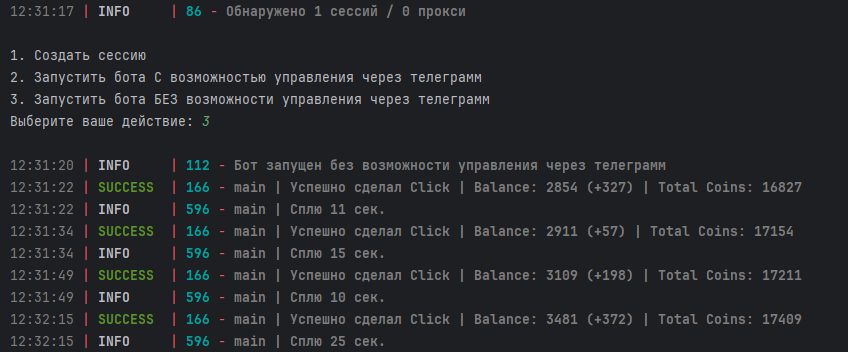

[](https://t.me/sho6ot)




> 🇷🇺 README на русском доступен [здесь](README.md)

## Functionality  
| Feature                                                                               | Supported |
|---------------------------------------------------------------------------------------|:---------:|
| Multithreading                                                                        |     ✅     |
| Proxy binding to session                                                              |     ✅     |
| Auto-purchase items when funds are available (energy boost, speed boost, click boost) |     ✅     |
| Random sleep time between clicks                                                      |     ✅     |
| Random number of clicks per request                                                   |     ✅     |
| Support for tdata / pyrogram .session / telethon .session                             |     ❌     |


## [Settings](https://github.com/shamhi/NotCoinBot/blob/main/config/config.py)
| Setting                              | Description                                                                                                                              |
|--------------------------------------|------------------------------------------------------------------------------------------------------------------------------------------|
| **API_ID / API_HASH**                | Platform data for starting a Telegram session (default - Android)                                                                        |
| **SERVER_HOST**                      | IP address on which the web application will be launched (e. g., 127.0.0.1)                                                              |
| **SERVER_PORT**                      | Port on which the web application will be launched (e. g., 63351)                                                                        |
| **MAX_BAD_STATUSES**                 | Maximum number of unsuccessful clicks, upon reaching which, a warning will be sent to Saved Messages (e. g., 10)                         |
| **MIN_CLICKS_COUNT**                 | Minimum number of clicks per request (calculated without the multiplier, e.g., with a multiplier of x9: 1 click equals 9 coins, not one) |
| **MIN_AVAILABLE_COINS**              | Minimum amount of coins at which a delay is triggered (e.g., 200)                                                                        |
| **AUTO_BUY_ENERGY_BOOST**            | Automatically buy Energy Boost when the balance is reached (True / False)                                                                |
| **MAX_ENERGY_BOOST**                 | Maximum level of Energy Boost upgrade (e.g., 10)                                                                                         |
| **AUTO_BUY_SPEED_BOOST**             | Automatically buy Speed Boost when the balance is reached (True / False)                                                                 |
| **MAX_SPEED_BOOST**                  | Maximum level of Speed Boost upgrade (e.g., 10)                                                                                          |
| **AUTO_BUY_CLICK_BOOST**             | Automatically buy Click Boost when the balance is reached (True / False)                                                                 |
| **MAX_CLICK_BOOST**                  | Maximum level of Click Boost upgrade (e.g., 10)                                                                                          |
| **SLEEP_BY_MIN_COINS**               | Whether to use a delay when reaching the minimum amount of coins (True / False)                                                          |
| **USE_PROXY_FROM_FILE**              | Whether to use Proxy from the `config/proxies.txt` file for accounts not bound to Proxy (True / False)                                   |
| **SLEEP_BETWEEN_CLICK**              | Range of delay between clicks (in seconds)                                                                                               |
| **SLEEP_BEFORE_BUY_MERGE**           | Range of delay before buying boosts (in seconds)                                                                                         |
| **SLEEP_BEFORE_ACTIVATE_FREE_BUFFS** | Range of delay before activating daily boosts (in seconds)                                                                               |
| **SLEEP_BEFORE_ACTIVATE_TURBO**      | Range of delay before activating Turbo (in seconds)                                                                                      |
| **SLEEP_TO_UPDATE_USER_DATA**        | Delay before updating user data (in minutes)                                                                                             |
| **SLEEP_BY_MIN_COINS_TIME**          | Delay when reaching the minimum amount of coins (in seconds)                                                                             |

## Installation
You can download the [**Git Repo**](https://github.com/shamhi/NotCoinBot) by cloning on your system and installing its requirements:
```
~ >>> git clone https://github.com/shamhi/NotCoinBot.git -b lite
~ >>> cd NotCoinBot

#Linux
~/NotCoinBot >>> python3 -m venv venv
~/NotCoinBot >>> source venv/bin/activate
~/NotCoinBot >>> pip3 install -r requirements.txt
~/NotCoinBot >>> cp .env-example .env
~/NotCoinBot >>> nano .env # Here you must specify your API_ID and API_HASH , the rest is taken by default
~/NotCoinBot >>> python3 main.py

#Windows
~/NotCoinBot >>> python -m venv venv
~/NotCoinBot >>> venv\Scripts\activate
~/NotCoinBot >>> pip install -r .\requirements.txt
~/NotCoinBot >>> # Copy the contents of .env-example
~/NotCoinBot >>> # Create a .env file in which you paste the copied data from .env-example and be sure to indicate your API_ID and API_HASH, the rest is taken by default
~/NotCoinBot >>> python main.py
```

You can also use arguments for quick launch, for example:
```
~/NotCoinBot >>> python3 main.py --action (1/2/3)
# Or
~/NotCoinBot >>> python3 main.py -a (1/2/3)

# 1 - Launches session registrar
# 2 - Launches with the ability to control via telegram
# 3 - Launches without the ability to control via telegram
```

## Docker
Manual installation:
```shell
# Creating an image
~/NotCoinBot >>> docker build -t notcoin_image .

# Run interactively
~/NotCoinBot >>> docker run --name notcoin_app -it notcoin_image

# Running in daemon mode
~/NotCoinBot >>> docker run --name notcoin_app -d notcoin_image
```

Installation via docker-compose:
```shell
# Run interactively
~/NotCoinBot >>> docker-compose up

# Running in daemon mode
~/NotCoinBot >>> docker-compose up -d
```
